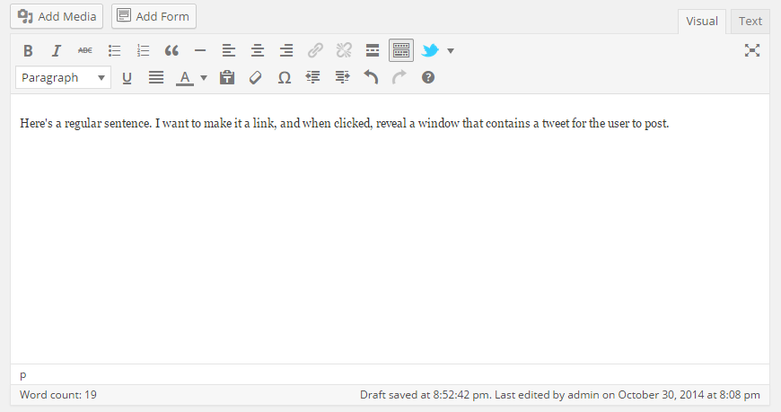
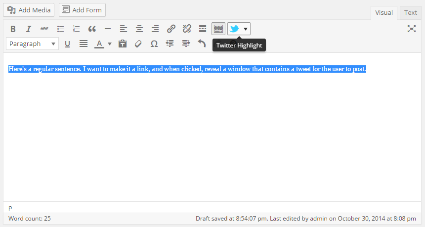
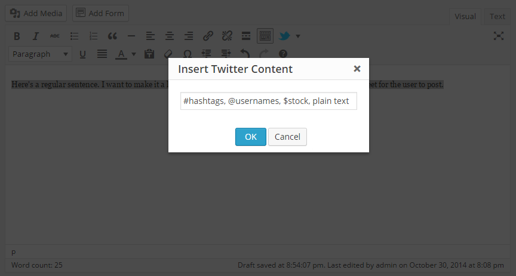
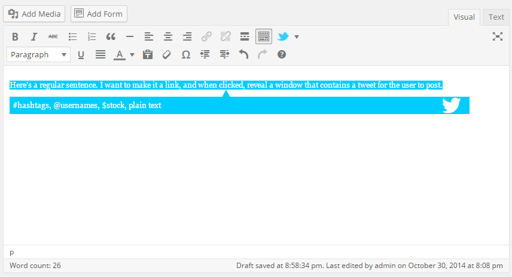
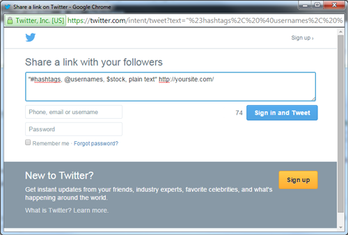

## WP-Tweetable-Text

### A different kind of plugin.

Wp-tweetable-text is a plugin for your wordpress dashboard, particularly the wysiwyg editor used to create posts.

This plugin enables content editors to embed a tweet into a post as a link. When the user clicks on the link, a twitter window is opened, which allows the user to post the tweet.

**Version**

0.0.1

**Dependencies**

- jQuery

**Installation**

1. Drag the wp-tweetable-text folder into the root of your current theme

2. The ``add-to-functions.php`` file contains the logic that activates the plugin. Place that code (omitting the opening/closing php tags) inside of your ``functions.php``

3. ``wp-tweetable-text.css`` and ``wp-tweetable-text.js`` should be placed in your themes css and javascript files. Edit them to your liking!

4. That's it! No need to activate anything!

**ScreenShots**

